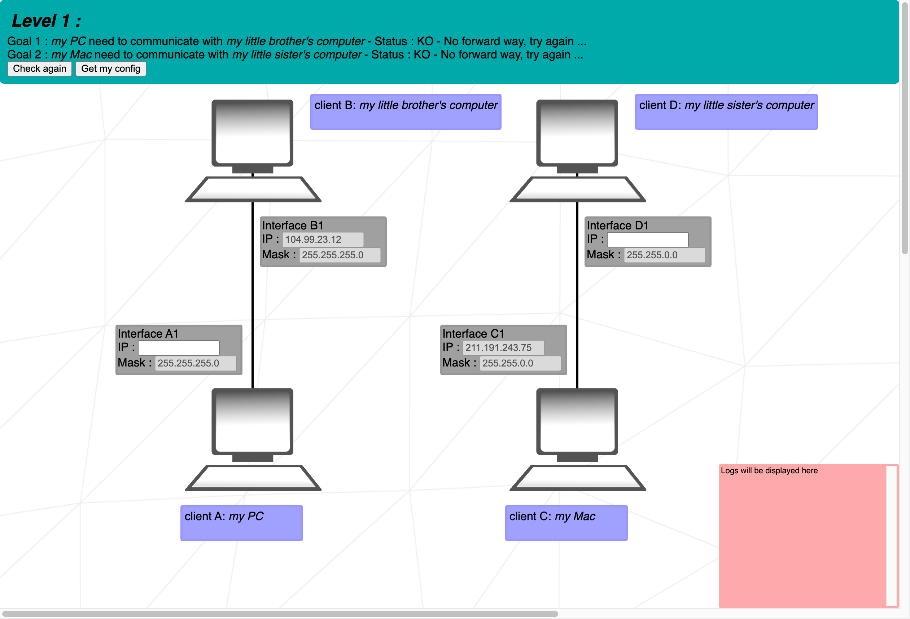
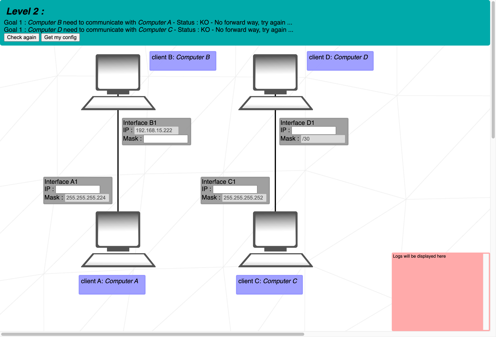
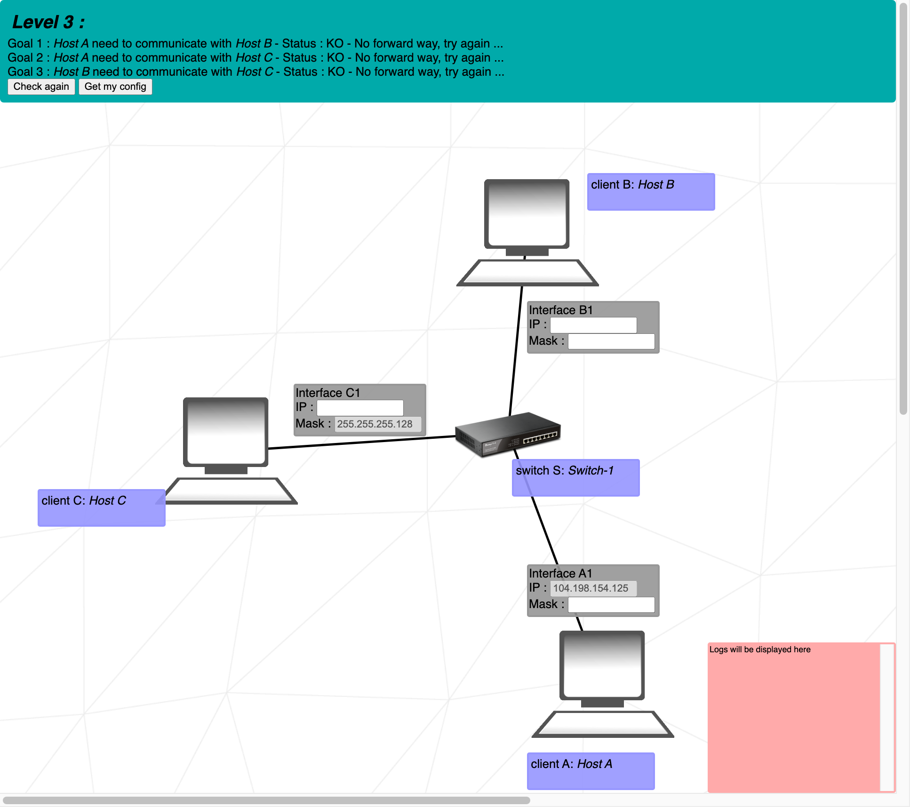
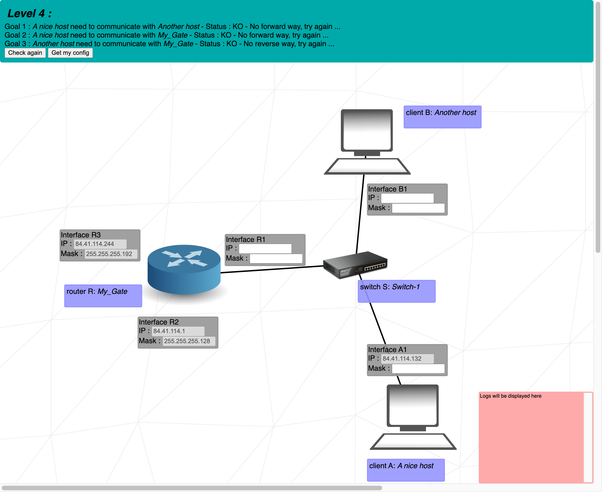
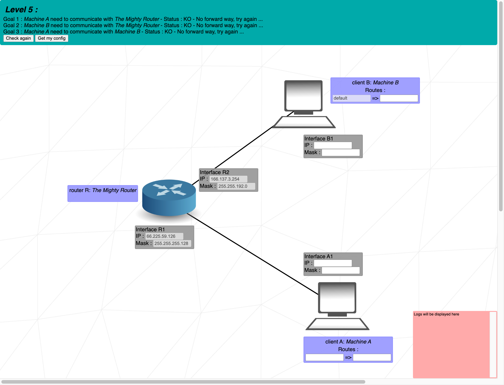
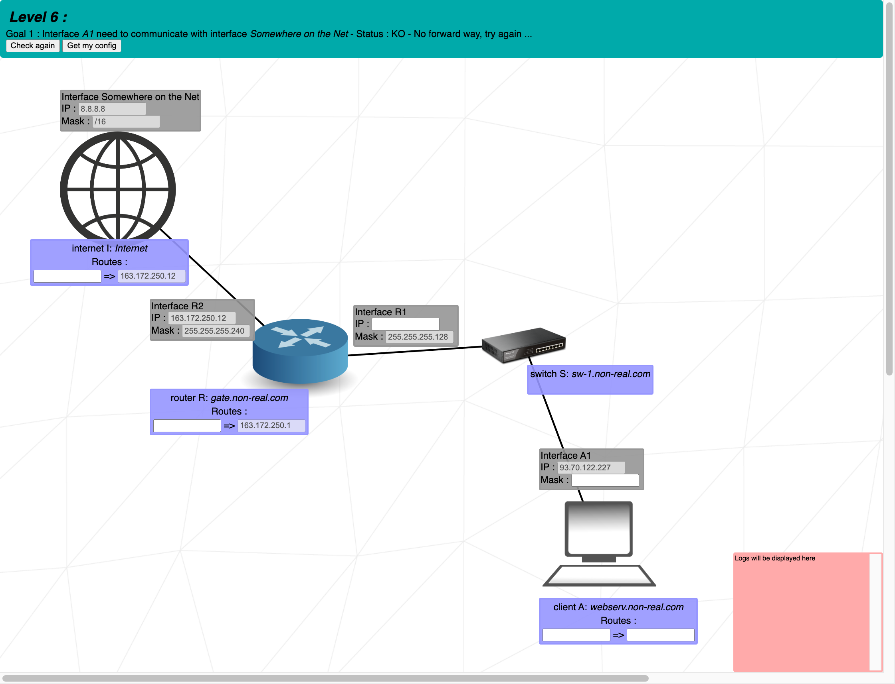
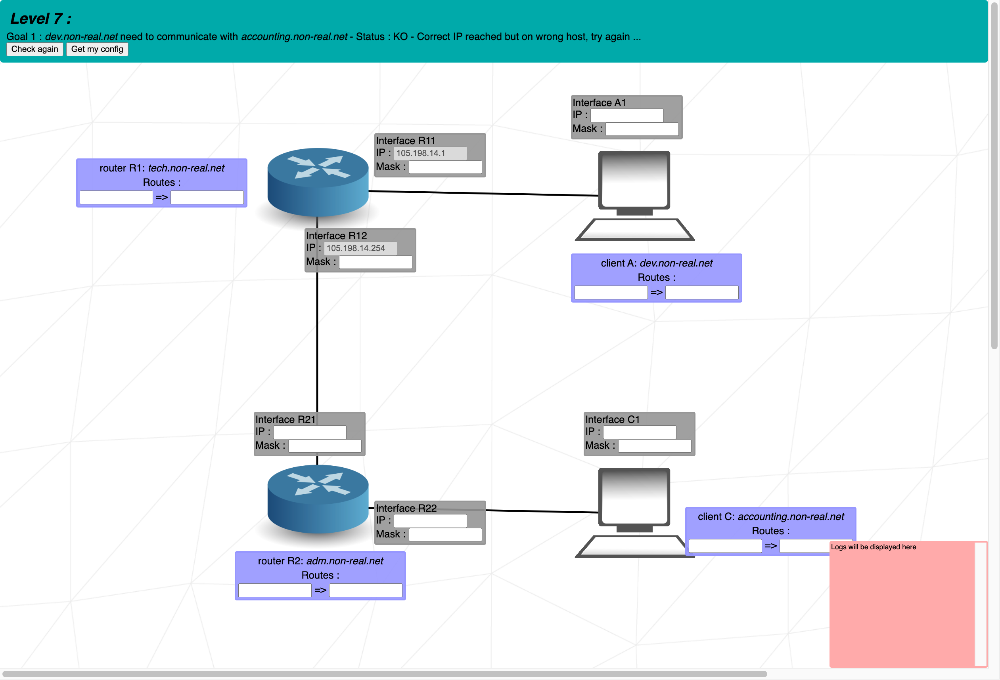
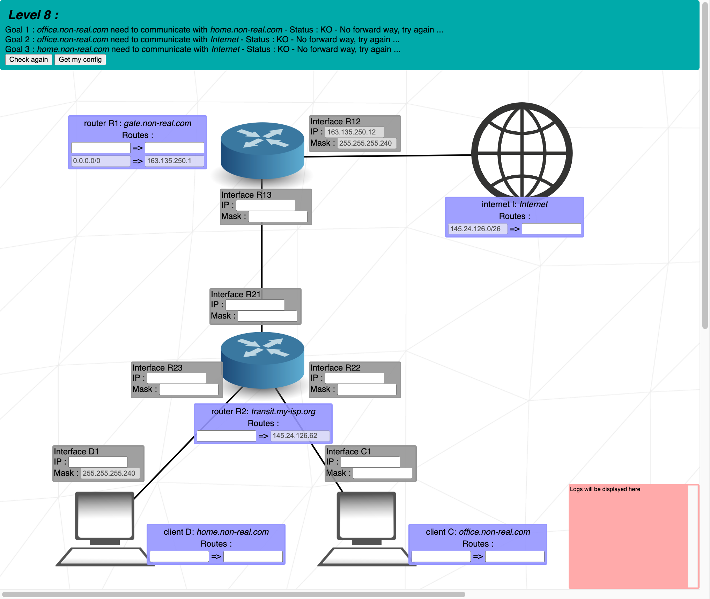

# 문제 풀이
## Level 1. IPv4

### 문제 의도
- IPv4 체계에서의 주소의 표현 가능 범위에 대해 알아보자.
- LAN(Local Area Network)에서의 IP 주소 지정 방식과 서브넷 마스크에 대해서 공부한다.
### Goal 1 : client A와 client B 연결
- 두 컴퓨터가 통신을 하기 위해서는 같은 네트워크에 들어있어야하므로, 네트워크 주소를 같게 한 뒤, 남은 부분으로 A의 주소를 B의 주소와 구분되도록 지정한다.
- 서브넷 마스크가 255.255.255.0 이므로, 24번째 비트까지가 (104.99.23.0) 네트워크 주소가 된다. 
1. 인터페이스 A의 IP 주소는 104.99.23.0 ~ 104.99.23.255 중에서 네트워크 주소인 (104.99.23.0)과 브로드캐스트 주소 (104.99.23.255), 그리고 인터페이스 B의 주소인 (104.99.23.12) 를 제외한 주소로 지정한다.
### Goal 2: client C와 client D 연결
- 서브넷 마스크가 255.255.0.0 이므로, 16번째 비트까지가 (211.191.0.0) 네트워크 주소가 된다.
1.  Goal 1과 마찬가지로, 인터페이스 D의 IP 주소는 211.191.0.0 ~ 211.191.255.255 중 네트워크 주소와 브로드캐스트 주소, 인터페이스 C의 주소를 제외한 주소로 지정한다.
## Level 2. Subnetting

### 문제 의도
- 서브넷 마스크의 표현 방식에 대해 알아보자.
- 브로드캐스트 주소에 대해서 알아보자.
- Loopback Address에 대해서 알아보자.
	- (는 127.0.0.0/8 범위를 사용하며, 일반적으로 127.0.0.1을 사용한다. 루프백 주소로 패킷을 보내면 외부로 전송되지 않고 로컬로 인식된다.)
### Goal 1: client A와 client B 연결
1. 인터페이스 B1의 서브넷 마스크를 인터페이스 A1의 서브넷 마스크와 같은 /27로 통일한다.
2. 인터페이스 A1의 주소를 192.168.15.192 ~ 192.168.15.223 중 네트워크 주소, 브로드캐스트 주소, B1의 주소를 제외한 주소로 지정한다.
### Goal 2: client C와 client D 연결 
- 문제의 기본값으로 작성되어 있는 127.0.0.1 은 루프백 주소(127.0.0.0/8) 이므로 피해야 한다.
1. 인터페이스 C1와 D1의 주소를 루프백 주소를 제외한 주소로, 단, 서브넷 마스크로 계산 했을 때 같은 네트워크 주소를 가지도록 설정한다.

## Level 3. Switch

### 문제 의도
- 스위치의 역할에 대해서 알아보자.
### Goal 2: A와 C 연결
- 스위치로 연결된 A, B, C 컴퓨터 모두 동일한 네트워크 내에서 통신을 해야한다
1. 따라서 인터페이스 C1의 서브넷 마스크 /25로 인터페이스 A1의 서브넷 마스크를 설정한다.
2. 서브넷 마스크가 /25, 인터페이스 A1의 IP 주소가 104.198.154.125 이므로, 인터페이스 C1의 IP 주소는 104.198.154.0 ~ 104.198.154.127 에서 네트워크 주소와 브로드캐스트 주소, 인터페이스 A1의 IP 주소를 제외한 주소로 지정한다.
### Goal 1: A와 B 연결

### Goal 3: B와 C 연결
- 인터페이스 A1과 인터페이스 C1은 동일한 네트워크로 설정을 마쳤으니, 인터페이스 B1 또한 설정해주면 Goal 1과 3이 동시에 해결된다.
1. 인터페이스 B1의 서브넷 마스크를 /25로 설정한다.
2. 인터페이스 B1의 IP 주소를  104.198.154.0 ~ 104.198.154.127에서 네트워크 주소, 브로드캐스트 주소, 인터페이스 A1, C1의 주소를 제외한 주소로 지정한다.
## Level 4. Router

### 문제 의도
- 라우터의 역할에 대해서 알아보자.
### Goal 2: A와 R 연결
- 라우터는 여러 네트워크들을 연결하게끔 해준다. 단, 서로 다른 네트워크들의 범위가 겹치면 안됨을 주의해 인터페이스 R1의 IP 주소와 서브넷 마스크를 지정해주면 된다.
- 라우터 R을 기준으로 인터페이스 R3와 연결된 네트워크의 IP주소 사용 범위는 84.41.114.192 ~ 84.41.114.255이다. 
- 라우터 R을 기준으로 인터페이스 R2와 연결된 네트워크의 IP주소 사용 범위는 84.41.114.0 ~ 84.41.114.127이다.
1. 인터페이스 R1은 위의 범위를 피하고, 84.41.114.132 주소를 포함하되, 인터페이스 A1과 같은 서브넷 마스크를 가져야 한다. 단, 네트워크에 인터페이스 A1, B1, R1이 필요하므로 서브넷 마스크는 /30보다 작아야 한다. 예를 들면, 84.41.114.128 ~ 84.41.114.191, /26은 인터페이스 A1의 주소를 포함하면서 다른 네트워크의 주소 범위와도 겹치지 않는다.
### Goal 1: A와 B 연결

### Goal 3: B와 R 연결
1. 인터페이스 A1과 B1의 서브넷 마스크와 IP 주소는 앞선 레벨과 같이 인터페이스 R1의 서브넷 마스크와 동일하게, 같은 네트워크 범위에 있도록 설정한다.
## Level 5

### 문제 의도
- 경로와 라우팅 테이블에 대해서 알아보자.
### Goal 1: A와 R 연결
### Goal 2: B와 R 연결
- Goal 1,2까지는 앞선 레벨 문제들과 동일하다. 인터페이스 A1의 주소와 서브넷 마스크는 인터페이스 R1을 기준으로, 인터페이스 B1의 주소와 서브넷 마스크는 인터페이스 R2를 기준으로 설정하면 된다.
### Goal 3: A와 B 연결
- A와 B는 다른 네트워크에 있기 때문에 A->B로, B->A로 패킷을 보내고 싶다면 경로를 지정해줘야한다. 그리고 그 패킷은 라우터로 제대로 보내져야 해당 네트워크에 보내질 수 있다. 
- 라우팅 테이블의 첫번째 필드는 목적지로, CIDR 형식으로 작성하고, 두번째 필드는 그 목적지로 가기 위해서 거쳐야 할 경로의 다음 인터페이스의 IP주소를 적으면 된다.
- A에서 B로 패킷을 보내려고 하면, A의 라우팅 테이블에서 해당 주소가 포함되는 곳이 있는지 찾아본다. 어떤 destination에 포함된다면, 해당 next hop으로 패킷을 보낸다.
- 보내려는 패킷이 라우팅 테이블의 어떠한 destination에도 포함되지 않는다면, default(0.0.0.0/0)에 포함되므로, default의 next hop으로 송신된다. (if-else 문의 else와 같다.)
- 이 문제에서는 경로가 하나뿐인데다가 A에서 B로만 패킷을 보내므로 destination을 default(0.0.0.0/0)로 작성해도 된다.
1. 인터페이스 B1의 IP 주소를 166.137.3.253, 서브넷 마스크는 /18 이라고 하자. 그러면 166.137.3.253/18을 포함하도록 destination을 적어주기만 하면 되나, 네트워크 주소(166.137.0.0/18)로 설정한다.
2. next hop은 인터페이스 R1의 IP 주소 66.255.59.126이 되어야 한다.
## Level 6

### 출제 의도
- 인터넷에 대해서 알아보자.
### Goal 1: A와 Net 상의 인터페이스와 연결
1. 앞선 문제들과 같이 인터페이스 R1의 IP주소와 인터페이스 A1의 서브넷 마스크를 먼저 설정한다.
2. 클라이언트 A와 라우터 R의 라우팅 테이블 Destination은 8.8.8.8/16, 혹은 default로 설정한다.
3. 클라이언트 A의 라우팅 테이블 Next hop은 인터페이스 R1의 IP 주소로 설정한다.
4. 인터넷의 라우팅 테이블 Destination은 인터페이스 A1의 네트워크를 써주면 된다. 예를 들면 93.70.122.128/25로 설정한다.
## Level 7

### 출제 의도
- 주소 범위가 겹치지 않게끔 네트워크를 설정한다.
### Goal 1: dev.non-real.net과 accounting.non-real.net 연결
- 3개의 네트워크를 서로 네트워크 주소 범위가 겹치지 않게 설정해주면 된다.
- 이후, 서로 다른 네트워크들끼리 패킷을 주고 받을 수 있도록 라우팅 테이블을 적절하게 설정한다.
1. (R11, A1), (R12, R21), (R22, C1) 총 3개의 네트워크를 구성하되, 서로의 주소 범위가 겹치지 않게 설정하는데, 
2. IP 주소와 서브넷 마스크 설정
3. 라우팅 테이블 default -> 같은 네트워크 상의 보내고자하는 쪽 인터페이스 IP 주소를 입력
## Level 8

### 출제  의도
- 
